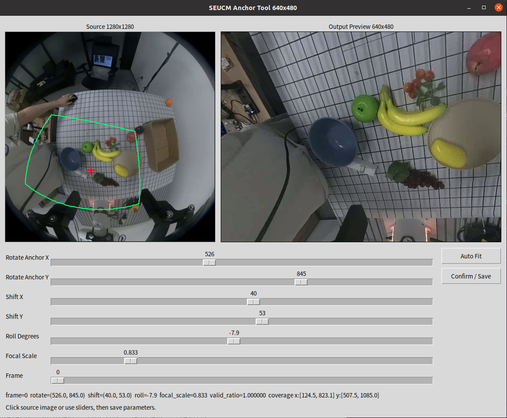

# SEUCM Anchor Tool 640x480



一个用于鱼眼视频去畸变和视角调整的小工具，带本地 GUI。

支持的调整参数：

- `rotate_anchor_x`
- `rotate_anchor_y`
- `shift_x`
- `shift_y`
- `roll_degrees`
- `focal_scale`

输出固定为 `640x480`。

## 文件说明

- `seucm_anchor_gui.py`：GUI 调参工具
- `seucm_rectify.py`：核心去畸变与映射逻辑
- `render_video_seucm_params.py`：按保存参数导出视频
- `rgb_calibration_250801DR48FP25002287_2026-03-08.json`：示例标定文件
- `undistort_params_640x480.json`：当前保存的参数
- `video_raw.mp4`：示例输入鱼眼视频
- `gui_screenshot.png`：GUI 示例截图

## 依赖

```bash
pip install -r requirements.txt
```

说明：

- `tkinter` 需要系统自带的 Python Tk 支持

## 启动 GUI

```bash
python3 seucm_anchor_gui.py video_raw.mp4 rgb_calibration_250801DR48FP25002287_2026-03-08.json
```

GUI 中可以：

- 点击左图设置旋转中心
- 调整 `Shift X / Shift Y`
- 调整 `Roll Degrees`
- 调整 `Focal Scale`
- 用 `Frame` 滑块切换预览帧
- 点击 `Auto Fit` 自动找不越界视野
- 点击 `Confirm / Save` 保存参数

## 导出视频

```bash
python3 render_video_seucm_params.py \
  video_raw.mp4 \
  rgb_calibration_250801DR48FP25002287_2026-03-08.json \
  undistort_params_640x480.json \
  video_undistorted_640x480.mp4
```

## 当前参数

当前 `undistort_params_640x480.json` 内容：

```json
{
  "rotate_anchor_x": 526.0,
  "rotate_anchor_y": 845.0,
  "shift_x": 40.0,
  "shift_y": 53.0,
  "roll_degrees": -7.9,
  "focal_scale": 0.833,
  "output_width": 640,
  "output_height": 480
}
```

## 补充说明

更详细的中文说明见：

- `使用说明_鱼眼转640x480.md`
